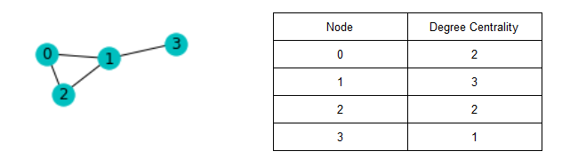
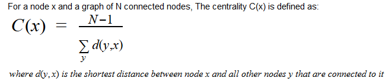
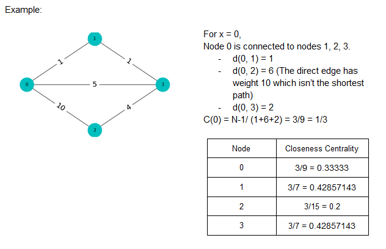
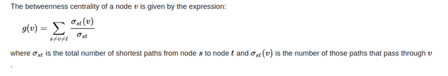
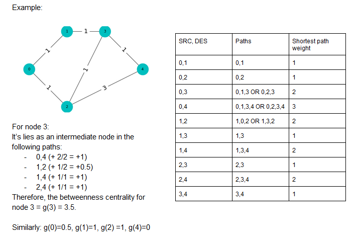

# Social-Media-Analysis
The project aims at : 
- Applying algorithms based on graph theory to compute the ** centrality property ** for each node in the *undirected graph*.
- **visualization** of the resultant *undirected graphs*.

### 1. Centrality in graphs
Centrality has many definitions. Each definition gives scores to nodes in different ways.
we will discuss three types of centrality.

#### i. Degree Centrality
Degree centrality is the simplest centrality measure to compute. Recall that a node's degree is simply a count of how many social connections (i.e., edges) it has.The degree centrality for a node is simply its degree.

Example:

#### ii. Closeness centrality
  Closeness centrality indicates how close a node is to all other nodes in the network. It is calculated as the average of the shortest path length from the node to every other node in the network.
  

#### iii. Betweennes centrality
Betweenness centrality measures the number of times a node lies on the shortest path between other nodes.

### 2. Graph visualization
This project aims to show you the visual picture of your input weighted undirected graph "combintion of nodes and weighted edges".

